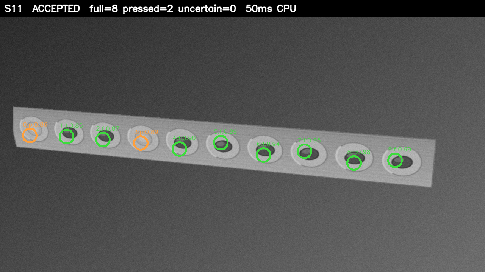

# Sankalp — dose evidence from a blister-strip photo

**Synthetic benchmark: 100% slot accuracy on 311 decided slots across 22 generated strips (20 accepted, 2 refused by the confidence gate); mean latency 270 ms on CPU.** Prototype status: the counting, gating, receipt, and verification loop runs end-to-end on this machine; the Android app is a skeleton; the Hindi voice path is a stub.

Read that first line carefully, because the qualifications matter:

- **All 22 test images are synthetic** (generated by `pipeline/generate_strips.py`, deterministic by seed). No real patient photos, no real-world accuracy claim.
- **Accuracy is selective**: it is measured over *decided* slots on strips the confidence gate *accepted*. Two degraded strips (heavy glare+shadow, glare+blur) were refused outright — that refusal is the system working, not a failure, and the gate check is asserted in the test (`gate_refused_expected_strips: true`).
- **The counter is a classical OpenCV heuristic, not a trained model.** Full = dark pill-shaped component; pressed = bright foil-center sheen; otherwise uncertain.
- **Format dimensions (rows × cols) come from the medication profile as a hint** — the realistic deployment path, since the patient's prescription is known. The hint only fits the slot lattice; every slot's *state* comes from image evidence. A no-hint auto-inference path exists but is experimental.
- **Delegate: CPU on x86_64 Linux.** No NNAPI, GPU, NPU, TFLite model, or Whisper runtime was measured anywhere in this repo.


*Real pipeline output on synthetic strip S20 (tilted): green = full, orange = pressed, with per-slot confidence. The strip was accepted; 7 full, 3 pressed, 0 uncertain.*

## What Sankalp proves

A TB patient photographs their blister strip after taking a dose. Sankalp counts **pills removed** (pressed slots), not pills present — **it proves removal, not ingestion**. The count must agree with a Hindi voice check-in before anything is recorded. The result is a **hash-chained, Ed25519-signed dose receipt** stored **only on the patient's device**. Raw photos are **purged after counting** — the ledger keeps counts, hashes, and signatures, never images.

Design rules the prototype enforces:

1. **Confidence gate**: if > 12% of slots are uncertain, the whole strip is refused — no partial counts, no receipt.
2. **Voice agreement**: a receipt mints only if the voice check-in says the dose was taken.
3. **Replay protection**: a re-photographed strip is detected by perceptual hash (dHash, Hamming < 10) and logged as a *gap event* — never double-counted, never punished.
4. **A gap is data, not a violation**: the provider console shows adherence against the patient's own baseline; missing days are visible, not penalized.

## Architecture

```
photo ──▶ foil_counter.py ──▶ gate ──▶ voice/checkin.py ──▶ receipts/mint.py ──▶ QR
   (count full/pressed/         │ refuse        │ agree           │ Ed25519 + SHA-256
    uncertain, CPU)             ▼               ▼                 │ chain, dHash replay
                          no receipt      no receipt              │ check, purge photo
                                                                      │
                          verifier/verify.py ◀── offline ───────────────┘
                          (chain + signatures + drift curve)
```

## Quickstart

```bash
pip install -r requirements.txt   # numpy, opencv, PyNaCl, qrcode, zxing-cpp, ...
./demo.sh                         # one command: full loop, ~30 s
```

`demo.sh` does, in order: (1) runs the 22-strip benchmark and prints the measured numbers; (2) creates a fresh device ledger + throwaway Ed25519 keys; (3) mints 12 illustrative backdated receipts (each labelled `demo_history: true`, one intentional gap day); (4) counts today's strip photo → voice check-in → signed receipt → QR (verified by decoding it back); (5) shows the confidence gate refusing a glare strip; (6) shows a re-photographed strip logged as a gap, not double-counted; (7) runs the offline verifier, which checks every signature, the hash chain, and renders the 14-day drift curve. It exits non-zero if any step fails.

Individual pieces:

```bash
# count one strip (rows/cols hint from the medication profile)
python3 pipeline/foil_counter.py photo.png --strip-id S01 --rows 2 --cols 7 \
    --format TB-2x7 --json-out /tmp/count.json

# regenerate the synthetic test set + benchmark (this is where metrics.json comes from)
python3 pipeline/test_pipeline.py

# voice check-in (STUB — see voice/README.md)
python3 voice/checkin.py --agree --out /tmp/voice.json

# mint (refuses automatically if count was refused or voice disagrees)
python3 receipts/mint.py --count /tmp/count.json --photo photo.png --voice /tmp/voice.json

# verify everything offline
python3 verifier/verify.py receipts/ledger
```

## Honest status: works vs in-progress

| Component | Status |
|---|---|
| Foil counting heuristic (OpenCV, CPU) | Works on the synthetic set; measured above |
| Confidence gate (refuse > 12% uncertain) | Works; refusal asserted in tests |
| Voice-gated minting | Works, but the voice side is a **stub** (operator-confirmed or energy heuristic — NOT Whisper, NOT transcription) |
| Ed25519-signed, hash-chained receipts | Works; verified offline |
| Replay protection (perceptual-hash duplicates → gap log) | Works; demonstrated in `demo.sh` |
| QR receipts with decode round-trip check | Works (zxing-cpp verified) |
| Offline verifier + 14-day drift curve | Works |
| Raw-photo purge after mint | Works (default on) |
| Android app (`android/`) | **Skeleton only** — Kotlin written, not compiled, no APK, no on-device measurements; delegate-selection code exists but no model, no NNAPI/NPU run |
| On-device Hindi Whisper | **Not built** — documented plan (faster-whisper int8, airplane mode) |

## Limitations and non-goals

- Synthetic benchmark only; real-strip accuracy is unmeasured and unclaimed.
- Slot *states* come from the image; the *lattice shape* uses the prescription's rows×cols hint (disclosed, not hidden).
- Demo keys are throwaway (`receipts/keygen.py` says so); production keys belong in the Android Keystore/StrongBox.
- The 14-day history in the demo is illustrative (receipts labelled `demo_history: true`); only the cryptography and the pipeline are real.
- No cloud, no accounts, no patient photos retained: the ledger holds counts, hashes, and signatures.

## Repo layout

```
pipeline/        foil counter, synthetic strip generator, benchmark + metrics
receipts/        keygen, minter (Ed25519/SHA-256/dHash/QR), ledger/ (runtime state)
verifier/        offline chain/signature verifier + drift curve
voice/           Hindi check-in STUB + honest README
android/         Kotlin skeleton (not compiled)
demo.sh          one-command end-to-end demo
```
